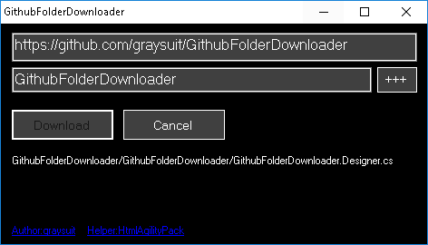

# GithubFolderDownloader
Hacky way to download github public folders without api key or ouath using graphical panel. Build it or use my binaries https://github.com/graysuit/GithubFolderDownloader/releases/download/1/win_anycpu.7z

## Mechanism
- Crawl all hyperlinks `<a>` and get its `href="value"` value
- if href value contains "**/tree/master/**" or "**/tree/main/**" then it is folder link :
`https://github.com/graysuit/GithubFolderDownloader  /tree/main/  GithubFolderDownloader`
    
- else if href value contains "**/blob/master/**" or "**/blob/main/**" then it is file link :
`https://github.com/graysuit/GithubFolderDownloader  /blob/main/  GithubFolderDownloader.sln`

- Afterwards, replace "**github.com**" with "**raw.githubusercontent.com**" and Remove "/blob/" from file :
`https://raw.githubusercontent.com/graysuit/GithubFolderDownloader/main/GithubFolderDownloader.sln`

- It would become RAW link. Now you can download it.  

## Features :
- No github api key or ouath required
- Graphical panel
- Supports win7 -- win10 (XP not tested)
- Extremely lite code and file size (lines < 110 and file size < 160 kb)

## Contact :
- Facebook: [gray.programmerz.5](https://fb.com/messages/t/gray.programmerz.5)
- Email:    [hackrefisher@gmail.com](mailto:hackrefisher@gmail.com)
- Website:  [tiplava](https://tiplava.blogspot.com)
- Discord:  [Fishes](https://discord.gg/Hu5XPGMTuk)

# I Love ALLAH + Holy Prophet + Islam and Pakistan.
